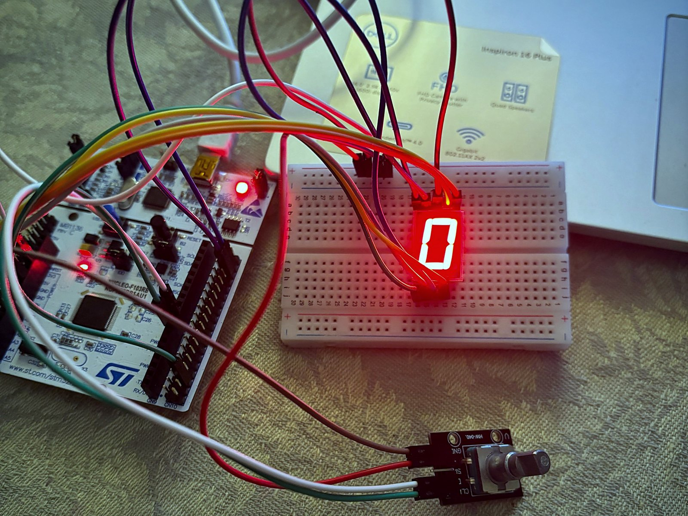
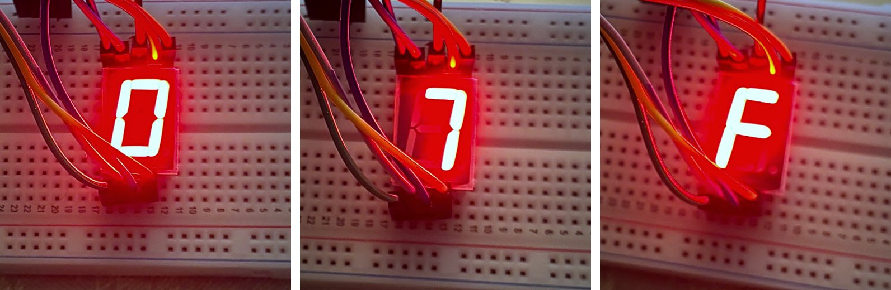
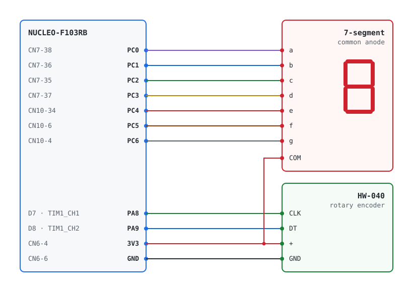

# Rotary encoder → seven-segment display (STM32F103, bare metal)

[](https://github.com/esbezborodov/mcu_hw/actions/workflows/build.yml)

Firmware for the NUCLEO-F103RB that turns a rotary encoder into a hex digit selector:
turning the knob steps the value through `0 … F` and shows it on a single seven-segment display.
Written directly against CMSIS registers, without HAL or LL.





## How it works

- **Encoder in hardware.** TIM1 runs in encoder mode on PA8/PA9 with the input filter enabled on
  both channels, so contact bounce is rejected by the timer and no CPU time is spent on decoding.
- **Position as a delta.** The 16-bit counter free-runs and is never written after start-up.
  The main loop reads the change since the last poll and adds it to the current digit, saturating
  at `0` and `F`, so fast turns cannot wrap the display around.
- **Display driver.** Glyphs are stored as segment masks (`a…g`) and inverted once for the
  common-anode display. Segments are updated through `BSRR`, touching only PC0–PC6 and only when
  the digit changes.
- **Clock.** SYSCLK is 64 MHz from the PLL fed by HSI/2, with two flash wait states.

## Hardware

| Part | Notes |
| --- | --- |
| NUCLEO-F103RB | STM32F103RB, Cortex-M3, on-board ST-LINK/V2-1 |
| Single-digit seven-segment display | common anode |
| HW-040 rotary encoder module (KY-040 compatible) | on-board pull-ups on CLK and DT |

### Wiring



| Signal | MCU pin | NUCLEO header |
| --- | --- | --- |
| Segment a | PC0 | CN7-38 (A5) |
| Segment b | PC1 | CN7-36 (A4) |
| Segment c | PC2 | CN7-35 |
| Segment d | PC3 | CN7-37 |
| Segment e | PC4 | CN10-34 |
| Segment f | PC5 | CN10-6 |
| Segment g | PC6 | CN10-4 |
| Display COM | 3V3 | CN6-4 |
| Encoder CLK | PA8 (TIM1_CH1) | CN10-23 (D7) |
| Encoder DT | PA9 (TIM1_CH2) | CN10-21 (D8) |
| Encoder + / GND | 3V3 / GND | CN6-4 / CN6-6 |

Pins and display polarity are defined in [`include/board.h`](include/board.h);
set `SEG7_COMMON_ANODE` to `0` for a common-cathode display.

> In the photos the segments are driven straight from the GPIO pins. For anything beyond a bench
> test, add a 220–470 Ω series resistor per segment.

## Build and flash

Requirements: `arm-none-eabi-gcc`, CMake ≥ 3.20, Ninja and OpenOCD.

```sh
# macOS
brew install --cask gcc-arm-embedded
brew install cmake ninja openocd

# Debian / Ubuntu
sudo apt install gcc-arm-none-eabi libnewlib-arm-none-eabi cmake ninja-build openocd
```

```sh
./build.sh            # Debug build   → build/debug/encoder_7seg.{elf,bin,hex}
./build.sh release    # Release build → build/release/
./flash.sh            # build and flash through the on-board ST-LINK
```

The scripts are thin wrappers around the CMake presets, so `cmake --preset debug` and
`cmake --build --preset debug` work the same way, including from CLion or VS Code.

## Project layout

```
include/        public headers: board pin map, clock, encoder, seg7, gpio helpers
src/            application and drivers
platform/       startup code, linker script, newlib stubs (STM32CubeIDE-generated)
drivers/CMSIS/  CMSIS core and STM32F1 device headers
cmake/          arm-none-eabi toolchain file
```

## Background

Originally written as homework for the *Microprocessor Systems Design* course and later
cleaned up: modular structure, CMake build, CI, and a fix for the counter wrap-around.

## License

The project code is released under the [MIT License](LICENSE).
CMSIS headers (Arm, Apache-2.0) and the files in `platform/` (STMicroelectronics, BSD-3-Clause)
keep their original licenses.
